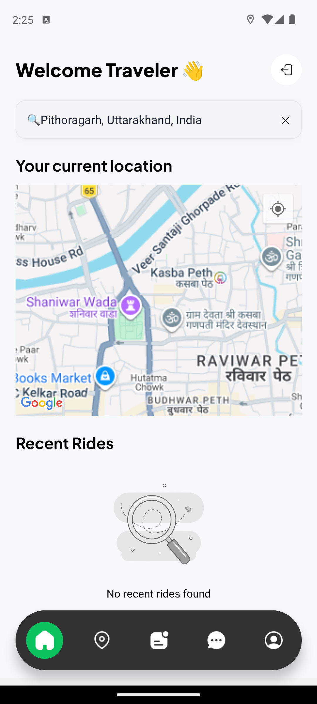
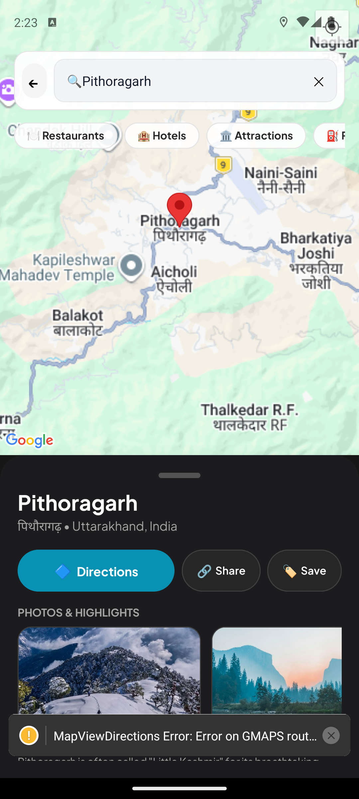
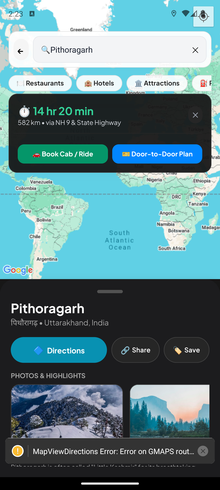
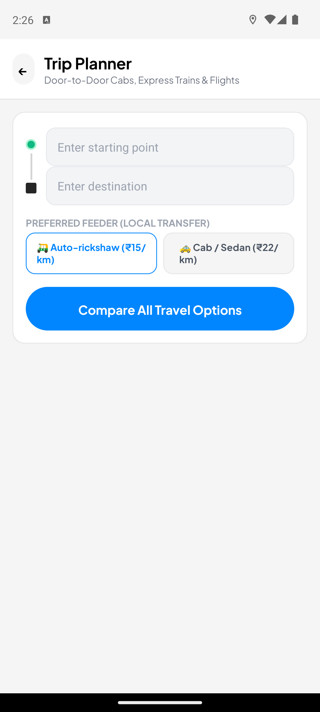
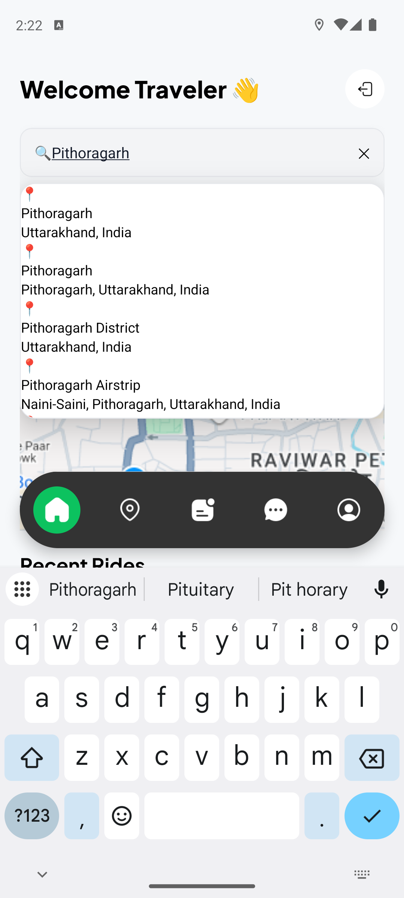
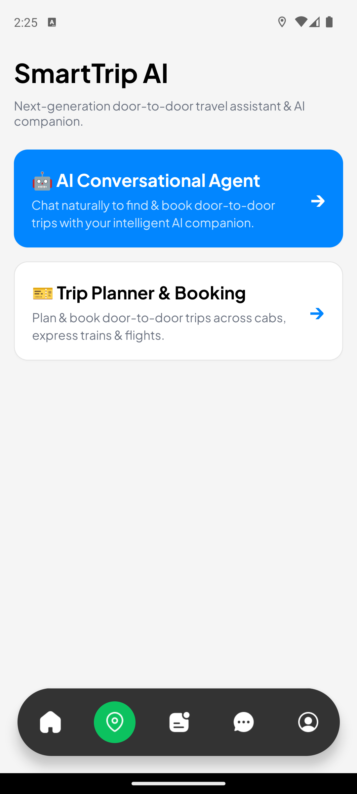
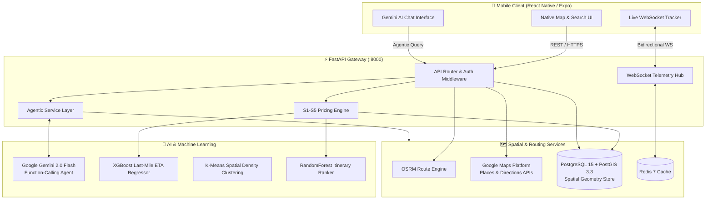

# 
🚀 SmartTrip AI

  <h3>Next-Generation Multimodal Door-to-Door Travel Assistant & Autonomous Transit Engine</h3>
  
Seamlessly fusing spatial routing, Google Maps explorer telemetry, Gemini 2.0 Flash agentic intelligence, transparent cross-subsidized pricing, and real-time transit telemetry.

---

## 📱 Live Mobile Interface Showcase

  
<em>Real-time screenshots captured from the standalone Android build (Pixel 8)</em>

| 1. High-Fidelity Street Maps | 2. Google Maps Place Explorer | 3. Live Directions & ETAs |
| :---: | :---: | :---: |
|  |  |  |
| **Native Vector Map Tiles** • Real-time driver markers (UberGo, Premier, Auto) • Sub-meter GPS positioning • Crisp topographic street layer | **Intelligent Place Explorer** • Category filters (Dining, Hotels, Sights) • Multilingual script details • High-res photo & highlight gallery | **Google Directions Telemetry** • Dynamic distance & duration calculations • Overview polyline tracing • Instant Cab & Door-to-Door booking buttons |

| 4. Connected Trip Planner | 5. Places Autocomplete | 6. SmartTrip Multimodal Hub |
| :---: | :---: | :---: |
|  |  |  |
| **Connected Uber-Style Inputs** • Green pickup dot &rarr; Black destination pin • Clean placeholders without sample text • Dynamic local feeder selectors (Auto / Cab) | **Google Places API (New)** • Debounced predictive search • Structured secondary address formatting • Direct route dispatch | **Integrated Gateway** • AI Conversational Agent entry • Multi-modal itinerary booking engine • Live journey telemetry tracking |

---

## 📌 Executive Summary & Problem Statement

Modern intercity transit in growing economies is notoriously fragmented. Travelers must independently juggle:
1. **First-mile feeder transport** (auto-rickshaws, cabs, or walking to transit hubs)
2. **Long-haul trunk carriers** (intercity express buses, Indian Railways trains, or domestic flights)
3. **Last-mile arrival transfers** to their ultimate destination

**SmartTrip AI** solves this disconnect by synthesizing all segments into a unified, single-ticket **door-to-door itinerary**. It couples high-precision geospatial routing with an autonomous **Gemini 2.0 Flash AI agent**, a transparent **cross-subsidized pricing engine (S1–S5)** that caps feeder fares, and a **tri-model machine learning suite** that accurately predicts real-world arrival times.

---

## 🏛️ System Architecture

---

## ✨ Core Capabilities & Engineering Highlights

### 1. 🤖 Autonomous Gemini 2.0 Flash Travel Agent
- **Natural Language Planning**: Handles ambiguous, conversational transit requests (*"Plan me a trip from Susgaon Pune to Pithoragarh with minimum walking"*).
- **Structured Tool Calling**: Operates with Google GenAI function declarations:
  - search_routes: Multi-modal queries across cabs, buses, express trains, and flights.
  - price_bundle: Dynamically computes S1–S5 financial subsidies.
  - ook_route: Dispatches booking confirmation intents.
- **Resilient Fallback**: Includes deterministic offline mock capabilities for zero-latency local development.

### 2. 💸 S1–S5 Algorithmic Pricing Engine
SmartTrip AI implements proprietary algorithmic fare rules to eliminate price gouging on last-mile segments:
- **S1 (High-Demand Corridor Cap)**: Caps high-density feeder corridor trips at ₹50.
- **S2 (Commission Cross-Subsidization)**: Reinvests up to 50% of the trunk bus/train commission directly into subsidizing the user's last-mile cab (min(50% trunk commission, 40% feeder fare)).
- **S3 (Unified Bundle Pricing)**: Fuses intercity transport and feeder transfer into a single transparent price.
- **S4 (SmartTrip Plus Subscription)**: Reduces pre-subsidy feeder fares to ₹20 for subscribed users.
- **S5 (Early Bird Incentive)**: Unlocks an additional 10% discount on last-mile transfers booked $\ge 6$ hours in advance.

### 3. 🗺️ Google Maps Place Explorer & Precision Navigation
- **High-Definition Street Rendering**: Built with direct tile server feeds and native Android SDK configuration, providing fluid pan-and-zoom vector graphics.
- **Place Details & Category Discovery**: Instant discovery chips for dining, lodging, sight-seeing, and fuel stations.
- **Live Google Directions Engine**: Polyline encoding/decoding with real-time distance and driving duration telemetry.

### 4. 🧠 Tri-Model Predictive ML Suite
- **Spatial Demand Clustering (KMeans)**: Dynamically groups traveler coordinates into high-efficiency shuttle aggregation points.
- **ETA Predictor (XGBoost)**: Supervised regression model trained on historical traffic metrics, hour-of-day, and road classification to predict precise arrival windows.
- **Journey Option Ranker (RandomForest)**: Ranks multimodal options against a multi-objective loss function (cost, duration, physical transfers, comfort).

### 5. 📡 Real-Time Telemetry & Driver Simulation
- **Bidirectional WebSockets**: Stream vehicle telemetry (/ws/track/{journey_id}) with live GPS lat/long updates.
- **Driver Simulator**: Built-in test script (driver_simulator.py) for stress-testing WebSocket connections and route progression.

---

## 🧰 Comprehensive Tech Stack

| Domain | Technologies |
|---|---|
| **Mobile Frontend** | React Native, Expo 51, Expo Router v3, NativeWind (TailwindCSS), Zustand, Lucide Icons |
| **Maps & Geospatial** | React Native Maps, Google Maps Platform (Places New, Directions, Geocoding), OSRM |
| **Backend Framework** | Python 3.11 / 3.12, FastAPI, Asyncio, Pydantic v2, Uvicorn |
| **Agentic AI** | Google Gemini 2.0 Flash (google-genai SDK), Native Function Calling |
| **Database & GIS** | PostgreSQL 15, PostGIS 3.3, GeoAlchemy2, SQLAlchemy 2.0 (Async), Alembic |
| **Caching & Messaging** | Redis 7, Starlette WebSockets |
| **Machine Learning** | Scikit-learn, XGBoost 2.0+, NumPy, Pandas |
| **Auth & Payments** | Clerk Authentication, Stripe React Native SDK |
| **DevOps & Tooling** | Docker, Docker Compose, Android Studio JBR, ADB |

---

## 📂 Repository Layout

`
SmartTripAI/
├── CONTRIBUTING.md                 # Developer setup, coding standards, and PR workflows
├── DEVELOPMENT_JOURNAL.md          # Chronological development timeline and decisions
├── README.md                       # Main repository architecture and documentation
├── docs/
│   └── screenshots/                # High-res mobile screenshots captured from emulator
├── smarttrip/                      # Backend Service Workspace
│   ├── backend/
│   │   ├── alembic/                # Database migrations
│   │   ├── app/                    # Core FastAPI routes, agent logic, and pricing engine
│   │   │   ├── api/                # API route controllers
│   │   │   ├── core/               # App configuration and settings
│   │   │   ├── models/             # SQLAlchemy ORM and PostGIS spatial schemas
│   │   │   └── services/           # Gemini AI agent, pricing engine, OSRM client, ML
│   │   ├── cli_agent.py            # CLI terminal chat with Gemini travel agent
│   │   ├── seed.py                 # PostGIS seed script for stops, corridors, and buses
│   │   └── Dockerfile              # Production Python container definition
│   └── docker-compose.yml          # Multi-container orchestration (API, PostGIS, Redis, OSRM)
└── uber-clone/                     # Frontend Mobile Application Workspace
    ├── android/                    # Standalone Android native project configuration
    ├── app/                        # File-based Expo Router navigation tree
    │   ├── (auth)/                 # Clerk authentication screens (sign-in, sign-up)
    │   └── (root)/                 # Authenticated application flows
    │       ├── (tabs)/             # Tab navigation (Home, SmartTrip, Profile)
    │       ├── explore-place.tsx   # Google Maps Place Explorer screen
    │       └── smarttrip/          # Multimodal Trip Planner & Agent screens
    ├── components/                 # Reusable UI widgets (Map, Input, RideCard)
    └── store/                      # Zustand reactive global state stores
`

---

## 🚀 Quickstart Guide

### Prerequisites
- **Docker Desktop** (with Docker Compose v2)
- **Python 3.11+**
- **Node.js 18+** & **npm**
- **Android Studio** (for local Android emulator testing)

---

### Step 1: Launch Backend Infrastructure

`ash
cd smarttrip/backend

# Set up Python virtual environment
python -m venv .venv
.\.venv\Scripts\Activate.ps1   # On Windows (or source .venv/bin/activate on macOS/Linux)

# Install backend dependencies
pip install -r requirements.txt

# Start FastAPI server
uvicorn app.main:app --host 0.0.0.0 --port 8000 --reload
`

- **Interactive Swagger Docs**: [http://localhost:8000/docs](http://localhost:8000/docs)
- **Health Check**: [http://localhost:8000/health](http://localhost:8000/health)

*(Optional: Run full multi-container stack via Docker Compose)*
`ash
cd smarttrip
docker compose up -d --build
docker compose exec api alembic upgrade head
docker compose exec api python seed.py
`

---

### Step 2: Launch Mobile Application (uber-clone)

In a new terminal window:

`ash
cd uber-clone

# Install npm dependencies
npm install

# Connect Android emulator ports to development servers
adb reverse tcp:8081 tcp:8081
adb reverse tcp:8000 tcp:8000

# Start Metro Bundler for standalone development client
npx expo start --dev-client
`

> **Note**: Press  in the Metro terminal or open the installed **Ryde / Uber** app on your Android emulator to load the live bundle.

---

### Step 3: Run Interactive AI Agent in Terminal

To test the Gemini 2.0 Flash travel agent directly from your command line:

`ash
cd smarttrip/backend
python cli_agent.py
`

`
============================================================
           SmartTrip AI - Conversational Terminal
============================================================
You: I want to travel from Susgaon to Bangalore tomorrow morning.
Agent: I found 3 multimodal options combining a local cab feeder with an express bus/train...
`

---

## 👨‍💻 Authors & Acknowledgements

Developed with passion by **Ashutosh Singh**, **Alankaar**, and team contributors.

- **GitHub**: [@ashutoshsingh220](https://github.com/ashutoshsingh220) | [@Alankaar63](https://github.com/Alankaar63)
- **Repository**: [SmartTripAI](https://github.com/ashutoshsingh220/SmartTripAI)
- **License**: MIT License
