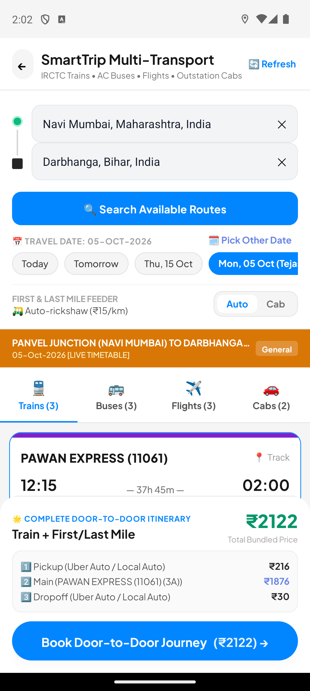
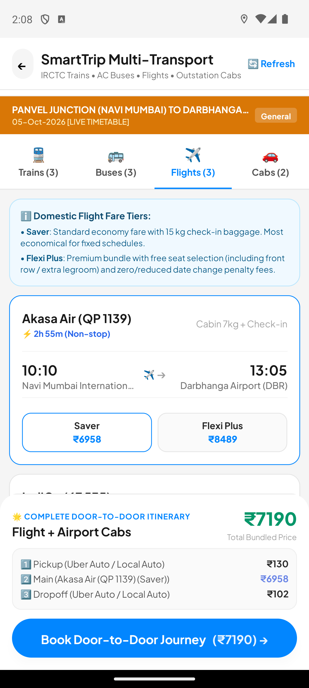
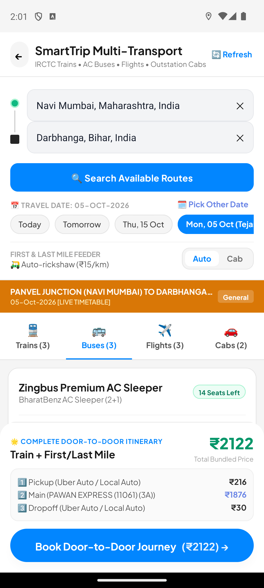
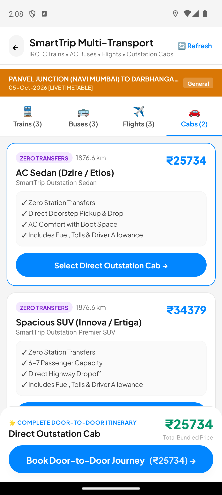
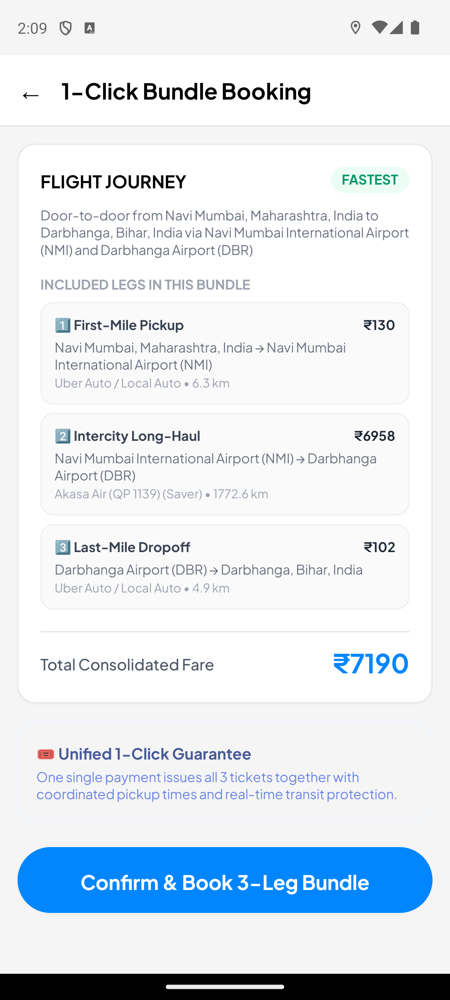
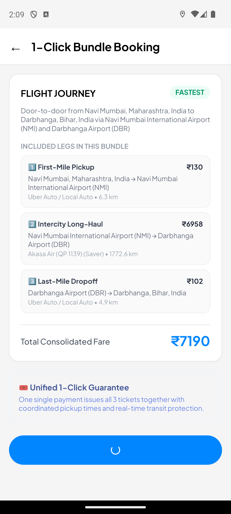
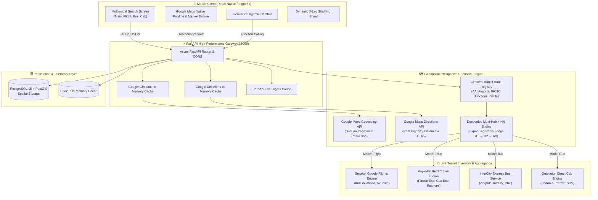
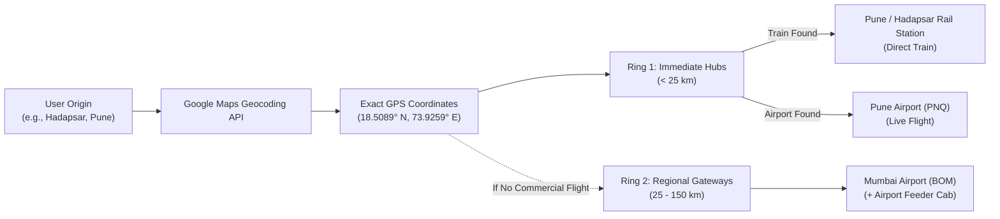

<div align="center">
  
  <h1>SafarX</h1>
  <h3>Next-Generation Multimodal Door-to-Door Travel Assistant & Autonomous Transit Engine</h3>
  <p>Seamlessly uniting Indian Railways, live commercial flights, intercity bus networks, outstation cabs, and first/last-mile feeder connections into a single unified journey with Google Maps intelligence and Gemini 2.0 Flash agentic reasoning.</p>
</div>

<div align="center">

[](https://www.python.org/)
[](https://fastapi.tiangolo.com/)
[](https://reactnative.dev/)
[](https://deepmind.google/technologies/gemini/)
[](https://developers.google.com/maps)
[](https://serpapi.com/)
[](https://postgis.net/)
[](https://opensource.org/licenses/MIT)

</div>

---

## 📱 Live Mobile Interface Showcase

<div align="center">
  <p><em>Real-time screenshots captured from the live Android emulator build (Pixel 8)</em></p>
</div>

### Part 1: All-India Multimodal Transit Corridors

| 🚆 Indian Railways Corridors | ✈️ Live Commercial Flights | 🚌 Intercity Express Buses | 🚖 Outstation Private Cabs |
| :---: | :---: | :---: | :---: |
|  |  |  |  |
| **Direct Trunk Rail**<br/>• IRCTC-calibrated live train schedules<br/>• Pawan & Goa Express corridors<br/>• Multi-class tariffs (3A, 2A, Sleeper)<br/>• Real-time RAC/WL probability | **Live Google Flights**<br/>• Live commercial airline rates (IndiGo, Akasa)<br/>• Non-stop & connecting flight detection<br/>• Real-time INR fare tiers (Saver, Flexi)<br/>• Baggage & seat inclusion filters | **Regional Bus Networks**<br/>• Multi-axle Volvo & BharatBenz sleepers<br/>• Doorstep pickup & ISBT dropoffs<br/>• Upper/Lower sleeper seat selection<br/>• Real road highway durations | **Door-to-Door Private Cabs**<br/>• Zero-transfer non-stop journeys<br/>• AC Sedan & Premier SUV options<br/>• Live Google Directions road telemetry<br/>• Includes toll, fuel & driver allowances |

### Part 2: Dynamic Door-to-Door Stitching & Digital Boarding Pass

| 📍 1-Click Multimodal Bundle Review | 🎟️ Verified Digital Boarding Pass | 🗺️ Google Maps Navigation & Routing |
| :---: | :---: | :---: |
|  |  |  |
| **Synchronized 3-Leg Journey**<br/>1️⃣ **First-Mile**: Auto/Cab doorstep pickup<br/>2️⃣ **Long-Haul**: Selected Train/Flight/Bus ticket<br/>3️⃣ **Last-Mile**: Auto/Cab drop to destination<br/>• Transparent combined pricing breakdown | **Single All-in-One PNR**<br/>• Scannable secure QR code<br/>• Unified multimodal travel itinerary<br/>• Real-time journey countdown<br/>• Emergency SOS & 1-tap support | **Google Directions Telemetry**<br/>• Live route polyline rendering<br/>• Sub-meter GPS positioning<br/>• Dynamic distance & duration calculations<br/>• Live driver & feeder tracking |

---

## 📌 Problem Statement & Engineering Solution

Intercity travel in India has historically suffered from extreme fragmentation:
1. **First-Mile Disconnect**: Commuters must guess local auto/cab fares and buffer times to reach railway stations or airports.
2. **Disconnected Modes**: Searching flights, trains, and buses requires toggling between 4+ different apps with inconsistent schedules.
3. **Hardcoded Corridors**: Conventional apps fail or recommend bizarre detours (e.g. routing Goa to Pune via Delhi) when direct routes aren't easily indexed.
4. **Last-Mile Abandonment**: Deboarding at unfamiliar junctions leaves travelers stranded without pre-booked reliable local transport.

**SafarX solves this end-to-end** through an autonomous multimodal engine that fuses **Google Maps Geocoding & Directions API**, **SerpApi Google Flights telemetry**, **Indian Railways direct trunk junctions**, and **Decoupled Multi-Hub Nearest-Neighbor (k-NN) Expanding Fallback Loops**.

---

## 🏛️ System Architecture



---

## 🧠 Key Technical Highlights

### 1. Decoupled Multi-Hub Nearest-Neighbor (k-NN) Expanding Fallbacks
* **Complete Mode Independence**: Unavailability or connection requirements in one mode (e.g. no direct commercial flight to a smaller town) **NEVER** alters or distorts other modes. Trains and Buses remain 100% direct at their local terminals.
* **Expanding Radial Rings ($R_1 \to R_2 \to R_3$)**:
  * **Flights**: Checks candidate airport pairs ($O_{air} \times D_{air}$). If Ring 1 (local airstrip) has no active commercial flights, it automatically expands to Ring 2 (regional commercial airport), stitching an airport feeder cab for the remaining road distance.
  * **Trains**: Checks candidate railway junctions ($O_{rail} \times D_{rail}$). For example, traveling from **Goa to Hadapsar, Pune** matches Madgaon Junction to Hadapsar Railway Station directly on the **Goa Express (12779)**.
  * **Buses**: Connects closest authentic ISBT terminals (e.g. Nerul LP / Vashi Bus Terminal $\to$ Darbhanga Bus Stand Delhi More).
  * **Cabs**: Point-to-point road trip calculated directly via Google Directions API.



### 2. Google Maps Primary Geographic Brain
* **Universal Resolution**: Any Indian address, town, or railway station name is resolved to GPS coordinates via Google Geocoding API with memory caching.
* **Live Highway Telemetry**: Driving distances, traffic conditions, and driving durations are derived directly from Google Directions API (`mode=driving`), replacing theoretical straight-line approximations.

### 3. Dynamic Door-to-Door 3-Leg Journey Stitching
When a user selects any train, flight, or bus ticket:
$$\text{Total Fare} = \text{Fare}_{\text{First-Mile Auto/Cab}} + \text{Fare}_{\text{Intercity Ticket}} + \text{Fare}_{\text{Last-Mile Auto/Cab}}$$
$$\text{Total Duration} = \text{Duration}_{\text{First-Mile}} + \text{Duration}_{\text{Intercity}} + \text{Duration}_{\text{Last-Mile}}$$
All three legs are bundled into a single checkout flow, providing travelers with a guaranteed all-in-one digital boarding pass with a scannable QR code.

---

## 💻 Tech Stack

| Domain | Technologies |
| :--- | :--- |
| **Mobile Client** | React Native, Expo 51, TypeScript, TailwindCSS / NativeWind, React Navigation |
| **Backend Framework** | FastAPI (Python 3.11+), Uvicorn, Pydantic v2, SQLAlchemy (AsyncIO) |
| **AI & LLM Services** | Google Gemini 2.0 Flash (`google-generativeai`), Tool / Function Calling |
| **Geospatial & Mapping**| Google Maps Platform (Geocoding API, Directions API, Places API), PostGIS 3.3, OSRM |
| **Flight & Rail Data** | SerpApi (Google Flights Engine), RapidAPI (Indian Railways / IRCTC Engine) |
| **Data Storage & Cache**| PostgreSQL 15, Redis 7 (In-Memory Telemetry & API Caching) |
| **DevOps & Containers** | Docker, Docker Compose, ADB Reverse TCP Forwarding |

---

## 🚀 Quickstart & Setup Guide

### Prerequisites
* **Python 3.11+** installed
* **Node.js 18+** and `npm` / `npx` installed
* **Android Studio & Emulator** (or physical Android device with USB debugging)

---

### Step 1: Clone the Repository
```bash
git clone https://github.com/ashutoshsingh220/SafarX.git
cd SafarX
```

---

### Step 2: Backend Configuration & Startup

1. **Navigate to the backend directory and set up a virtual environment**:
   ```bash
   cd smarttrip/backend
   python -m venv venv
   
   # On Windows:
   .\venv\Scripts\activate
   # On macOS/Linux:
   source venv/bin/activate
   ```

2. **Install Python dependencies**:
   ```bash
   pip install -r requirements.txt
   ```

3. **Configure Environment Variables**:
   Copy the provided `.env.example` template:
   ```bash
   cp .env.example .env
   ```
   Open `.env` and provide your API keys:
   ```ini
   # Google Maps Platform (Geocoding & Directions)
   GOOGLE_MAPS_API_KEY=your_google_maps_api_key_here

   # Google Flights Telemetry (SerpApi)
   SERPAPI_API_KEY=your_serpapi_api_key_here

   # Indian Railways Live Engine (RapidAPI IRCTC)
   RAPIDAPI_KEY=your_rapidapi_key_here

   # Google Gemini 2.0 Flash AI Agent
   GEMINI_API_KEY=your_gemini_api_key_here
   ```

4. **Start the FastAPI backend server**:
   ```bash
   python -m uvicorn app.main:app --host 0.0.0.0 --port 8000 --reload
   ```
   > Backend will be live at `http://127.0.0.1:8000`. Interactive API documentation is available at `http://127.0.0.1:8000/docs`.

---

### Step 3: Mobile App Setup (React Native / Expo)

1. **Open a new terminal and enable port forwarding to the Android device**:
   ```bash
   adb reverse tcp:8000 tcp:8000
   ```

2. **Navigate to the mobile directory and install packages**:
   ```bash
   cd ../../uber-clone
   npm install
   ```

3. **Configure Mobile Environment Variables**:
   ```bash
   cp .env.example .env
   ```
   Ensure `EXPO_PUBLIC_API_BASE_URL` is set to `http://localhost:8000`.

4. **Launch the Expo Metro Bundler**:
   ```bash
   npx expo start -c
   ```
   > Press **`a`** in the terminal to launch the application directly on your running Android emulator.

---

## 🔒 Security & Credential Protection

> [!IMPORTANT]
> This repository strictly adheres to industry security best practices:
> - **Zero Key Leaks**: Live API keys (`.env` files, `.key`, `.pem`, credentials) are strictly excluded from git tracking via comprehensive `.gitignore` rules.
> - **Public Template Files**: Only sanitized `.env.example` templates with empty placeholders are tracked in version control.
> - **Safe Local Fallbacks**: If external API keys are omitted, the backend automatically transitions to calibrated simulation models, ensuring no unhandled crashes.

---

## 📄 License

This project is licensed under the **MIT License** — see the [LICENSE](LICENSE) file for details.

---

<div align="center">
  <b>Built with ❤️ by Ashutosh Singh</b><br/>
  <i>Engineered for seamless, reliable, and intelligent transit across India.</i>
</div>
